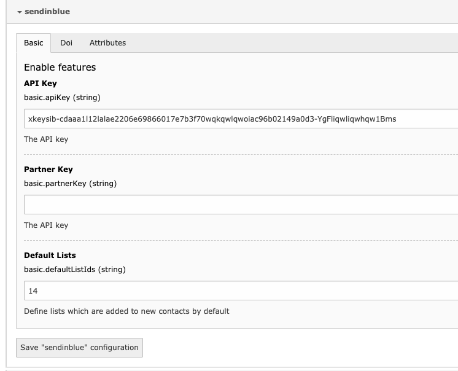
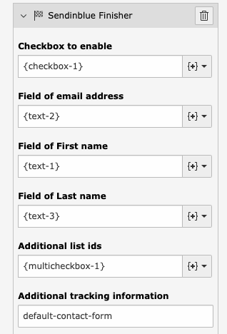

# TYPO3 Extension `brevo` (formally known as sendinblue)

This extension integrates the newsletter SaaS https://brevo.com/ into TYPO3.
Currently this extension supports *only* the form framework of the core but it would be easy to add finishers to powermail.

## Installation & Configuration

Currently this extension requires a composer based installation. Use `composer req studiomitte/brevo` to install it.

Head over to the extension configuration and provide all settings you need:



- **Basic**
  - *API-Key*: Add your API key which you can retrieve from https://account.brevo.com/advanced/api.
  - *Partner Key*: currently not in use
  - Default Lists*: Add IDs of brevo contact lists which are added to every contact
- **DOI**
  - *Enable double optin*: Please always use double opt in!
  - *Page ID for redirect*: Page which a user is sent to after confirming double opt in
  - *DOI Template*: Id of brevo template which is used for DOI mails.
- **Attributes**
  - *Attribute for first name*: Name of attribute used for the first name
  - *Attribute for last name*: Name of attribute used for the last name
  - *Attribute for tracking information*: Name of attribute used for the tracking information

## Usage

A new finisher *Brevo Finisher* intercepts the data of the form and adds the contact.

> **Example configuration** can be found at `EXT:brevo/Resources/Private/Example/brevo-example.form.yaml`.



As the fields can be different for any form, you need to provide the mapping information for all important fields:

- *Checkbox to enable*: Newsletter subscription must be optional. Therefore provide the checkbox which asks the user if a newsletter should be sent.
- *Field of email address*: Provide the field information which holds the email address
- *Field of First/Last name*: Provide the field information which holds information about the name.
- *Additional list ids*: Either provide the field information or a static comma separated list of contact lists a user should be added to.
- *Additional tracking information*: This string is added to the contact and can be used just as information or by using this in the automation process to process the contact.

## Additional hints

### Getting started

It is a bit tricky to get everything started. For sending mails the account needs to be validated. This is documented at https://help.brevo.com/hc/en-us/articles/360016175440

In short you need

1) At least **11** contacts. You can create any contact
2) One campaign ready

### (DOI) Double Opt-In Mails

Getting started with that is also a bit tricky for the 1st time. This is documented at https://help.brevo.com/hc/en-us/articles/211244629 but still misses some important things:

1. The DOI template needs to be tagged with `optin`.
2. The button in the DOI template for triggering the confirmation must have as link value `{{ doubleoptin }}`.

### Override global configuration per form

The following configurations can be used to override the global settings

```yaml
  -
    options:
       doiTemplateId: '14'
       defaultListIds: '12,34'
    identifier: Brevo
```

## Author

This extension has been created by [StudioMitte](https://studiomitte.com)


